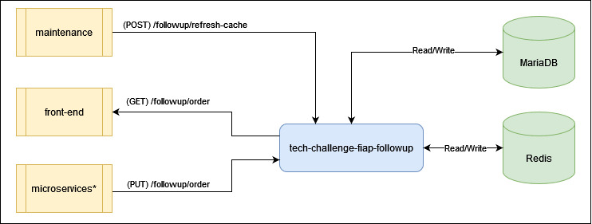
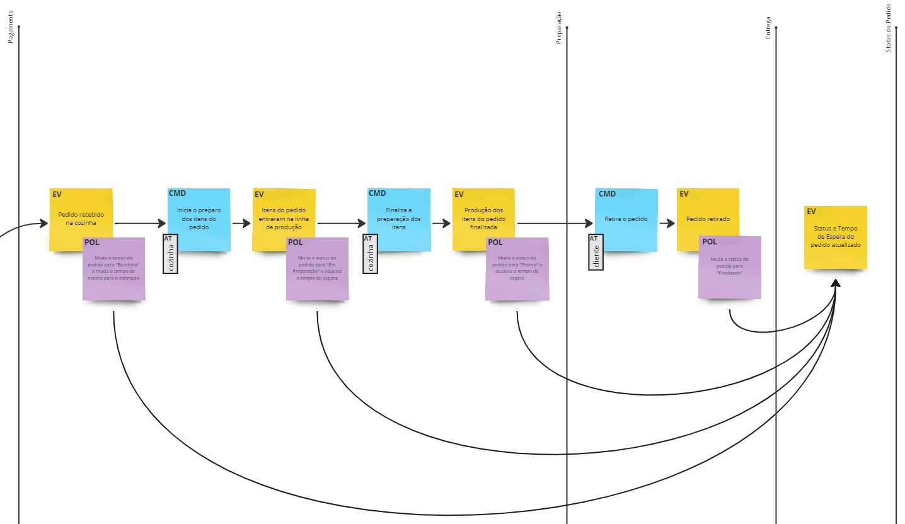

# FIAP 2023 - Pós Tech - Tech Callenge - Fase 4

## Back-end do subsistema de Acompanhamento (follow-up)

### Escopo
Uma vez que o pedido é confirmado e pago, ele é enviado para a cozinha para ser preparado. Simultaneamente deve aparecer em um monitor para o cliente acompanhar o progresso do seu pedido com as seguintes etapas:
* Recebido
* Em preparação
* Pronto
* Finalizado

O subsistema de Acompanhamento é passivo no fluxo da aplicação e não tem lógica de controle do negócio. É um subsistema com a responsabilidade de alterar e recuperar as informações de status dos pedidos criados na base de dados "principal", porém as solicitações para essa alteração devem ser realizadas pelos subsistemas do fluxo principal da aplicação como o de criação de ordem e controle de produção

Deve ter alta capacidade de recuperação e disponibilização das informações dos pedidos, uma vez que o front-end tem a meta de realizar a atualização das informações no monitor para o cliente com no máximo 8 segundos de atraso em relação a efetivação da alteração do status de um pedido

---

### Requisitos

#### Inicialização do serviço
- Ao ser inicializado o subsistema de acompanhamento deve recuperar todos os pedidos que não estejam com o status Finalizado do banco de dados relacional e deve carrega-los no banco de dados não relacional do tipo chave-valor.
    - chave = pedido
    - valor = status

#### Recurso para adicionar uma ordem (sincronizar) na base de dados não relacional
- Ao receber uma "request" para sincronização (método POS) de um pedido o recurso deve validar:
    - O pedido existe na base de dados relacional
    - O status é um status válido
        - Deve verificar a sequência permitida para cada status
    - Atenção: um pedido no status Finalizado não deve ser sincronizado base de dados não relacional
- Caso ocorra algum erro na validação, retornar o código de erro http 400 com a descrição do erro
- Caso ocorra sucesso na validação, o subsistema deve realizar a adição da chave/valor base de dados não relacional do pedido com o seu status atual
    - No caso de sucesso na alteração, deve retornar o código http 200 com uma mensagem
    - No caso de erro ao realizar a alteração, em qualquer um dos bancos, não deve efetivar a alteração em nenhum dos bancos e deve retornar um código http 500 com a mensagem de erro

#### Recurso de alteração de status de um pedido
- Ao receber uma "request" para alteração do status (método PUT) de um pedido o recurso deve validar:
    - O pedido existe na base de dados relacional
    - O status é um status válido
        - Deve verificar a sequência permitida para cada status
    - Atenção: um pedido no status Finalizado não deve ser alterado para nenhum outro status
- Caso ocorra algum erro na validação, retornar o código de erro http 400 com a descrição do erro
- Caso ocorra sucesso na validação, o subsistema deve realizar a alteração na base de dados relacional e não relacional do pedido com o seu novo status
    - No caso de sucesso na alteração, deve retornar o código http 200 com uma mensagem
    - No caso de erro ao realizar a alteração, em qualquer um dos bancos, não deve efetivar a alteração em nenhum dos bancos e deve retornar um código http 500 com a mensagem de erro
- Ao momento em que o status de um pedido é modificado, com sucesso, para o status **Finalizado**, deve-se adicionando um tempo de expiração de 3 minutos para o pedido (chave) em questão no banco de dados não relacional

#### Recurso de recuperação da lista de pedidos a ativos e seus respectivos status
- Ao receber uma "request" para recuperação dos pedidos *ativos*, o subsistema deve retornar todos os pedidos contidos na base de dados não relacional no formato JSON como uma estrutura de lista de objetos contendo o número do pedido, o status do pedido e a data de criação do pedido
- Caso o subsistema encontre ao menos um registro na base de dados, deve retornar um código http 200 com a lista de pedidos encontrados
- Caso a “request” não encontre nenhum registro, deve retornar um código http 200 com uma lista vazia
- Caso ocorra um erro ao processar a recuperação da lista, o subsistema deve retornar um código http 500 com a mensagem de erro

#### Recurso para refresh completo da base de dados não relacional 
- Ao receber a "request" para refresh do "cache" (base de dados não relacional) o serviço deve:
    - Excluir todas as chaves do banco de dados não relacional
    - Recuperar todos os pedidos com status diferente de **Finalizado**
    - Inserir esse conjunto de valores na base de dados não relacional, com o mesmo padrão que foi usado no recurso de inicialização
- Caso ocorra sucesso no refresh, deve retornar o código http 200 com uma mensagem
- Caso ocorra erro ao realizar o refresh, em qualquer um dos bancos, não deve efetivar a carga na base de dados não relacional e deve retornar um código http 500 com a mensagem de erro

---

### API:
[Documentação Open API da API do subsistema de Acompanhamento](./docs/openapi_followup.yaml "Open API").
- melhor visualizado com o Visual Studio Code + OpenAPI Editor Plugin

---

### Diagramas

#### Arquitetura macro do microsserviço *tech-challenge-fiap-followup*

#### Event Storm do domínio do *tech-challenge-fiap-followup*

Para visualização completa do Evento Storm da aplicação acesse: [miro.com](https://miro.com/app/board/uXjVMB4KwXo=/)

---

### Artefatos
- [Repositório público no ECR da AWS](https://gallery.ecr.aws/u0d1o6m1/tech-challenge-fiap-followup)
- [Repositório público de relatórios do SonarCloud](https://sonarcloud.io/project/pull_requests_list?id=felipeksw_tech-challenge-fiap-followup)

---

### Entregáveis
Dando continuidade ao desenvolvimento do software para a lanchonete, teremos as seguintes melhorias e alterações:
- [x] Refatore o projeto separando em ao menos 3 microsserviços:
    - ~~Pedido: responsável por retornar as informações necessárias para montar um pedido.~~
    - ~~Pagamento: responsável por realizar a cobrança de um pedido gerado anteriormente.~~
    - **Produção**: responsável por acompanhar a produção/fila de pedidos e atualização de status.
- [x] Lembre-se de trabalhar com bancos de dados para cada aplicação. Use ao menos um banco de dados NoSQL e um SQL; caso queira fazer com mais bancos, você pode decidir quais utilizar. 
- [x] Ao refatorar, os microsserviços devem conter testes unitários usando BDD com no mínimo 80% de cobertura de testes por cada microsserviço.
- [x] Seus repositórios devem ser separados para cada aplicação e devem respeitar as seguintes regras:
    - [x] Main protegida.
    - [x] PR para branch main deve validar o build da aplicação, e qualidade de código via sonarqube.
    - [x] Automatize o deploy dos seus microsserviços.
